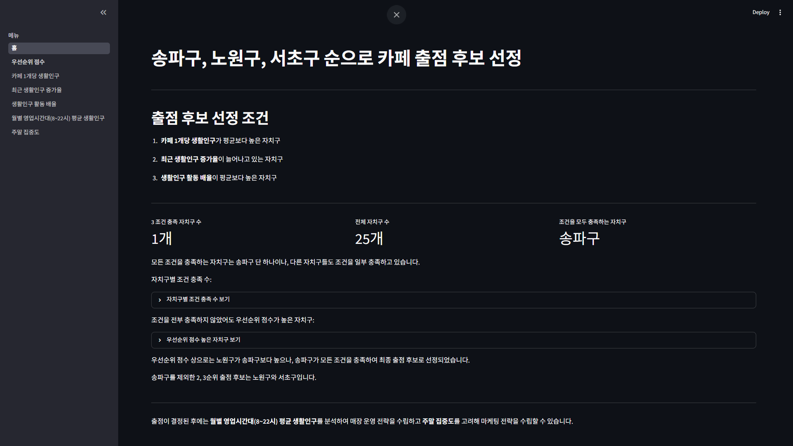

# 카페 상권 분석 대시보드

## 개요

* 6월 30일을 기준으로 서울시의 카페, 거주인구, 생활인구 데이터를 활용해 카페 출점 후보를 선정하고 대시보드를 만든 프로젝트 입니다.

## Streamlit 배포된 링크

* <https://mainpy-aljf2f9qwevehjymywyuxm.streamlit.app/>

## 실행 순서

### 로컬 데이터베이스

1. DB 초기화
    * mysql -u analyzer -p < db/schema.sql
2. 데이터 수집
    * python -m collector
3. 마트 테이블 생성
    * python -m build_mart.py
4. 대시보드 실행
    * streamlit run app/main.py

## 대시보드 예시

