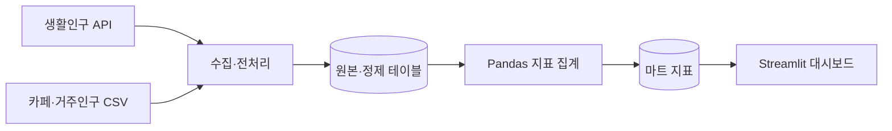

# 서울시 카페 출점 후보 선정 대시보드

## 1. 대시보드가 답하는 질문

서울에서 카페 출점을 검토할 때 인구가 많은 지역이라는 이유만으로 입지를 결정하기는 어렵다. 지역에 머무는 인구가 많더라도 기존 카페가 밀집해 있을 수 있고, 거주인구가 많아도 분석 대상 영업시간대의 활동 규모는 다를 수 있기 때문이다. 본 프로젝트는 생활인구, 카페 수, 거주인구를 결합하여 서울 25개 자치구 중 현장 조사를 우선 진행할 후보를 선정하는 대시보드를 구축했다.

분석 질문은 “카페 수 대비 생활인구, 최근 생활인구 변화, 거주인구 대비 활동 수준을 함께 고려할 때 어느 자치구를 먼저 검토할 것인가?”이다. 대상 사용자는 카페 창업자와 출점 담당자이며, 의사결정 범위는 자치구 단위의 1차 후보 선정이다.

분석 결과는 **송파구를 우선 검토하고, 노원구와 구로구를 후속 후보로 비교하는 것**이다. 송파구는 설정한 세 가지 조건을 모두 충족하고, 노원구와 구로구는 종합 점수가 높다. 이 순서는 종합 점수만 내림차순으로 정렬한 순서와 구분된다.

## 2. 데이터 수집

### 사용 데이터와 수집 범위

분석 기준은 2026년 6월이며, 생활인구 관측 기간은 2026년 1월 1일부터 6월 30일까지이다. 수집한 시간대는 08~23시이지만, 실제 지표 계산에는 프로젝트에서 영업시간대로 설정한 **08~22시의 15개 시간대**를 사용한다. 이는 모든 카페의 실제 영업시간을 조사한 결과가 아니라 지역 간 비교를 위한 공통 분석 시간대이다.

| 데이터 | 프로젝트에서 사용한 출처 | 기준 및 활용 |
| --- | --- | --- |
| 생활인구 | 서울 Open API `Spop250mLocalResdJachi` | 2026년 상반기 자치구·날짜·시간대별 생활인구 |
| 카페 현황 | 소상공인시장진흥공단 상가(상권)정보 서울 CSV | 2026년 6월 자료에서 업종 소분류가 `카페`인 사업체 추출 |
| 거주인구 | 행정안전부 지역별 성별·연령별 주민등록 인구 CSV | 2026년 6월 30일 자료의 서울특별시 행을 자치구별로 합산 |

출처와 기준일은 데이터를 다운로드 받은 웹사이트에 적힌 내용에 근거한다. 생활인구는 거주인구와 함께 지역의 활동 규모를 살펴보기 위한 지표로 사용한다. 첫번째 프로젝트에서 찾은 결과로 거주인구의 특성만으로 지역별 카페 수 차이를 설명하기 어려웠기 때문에, 생활인구를 활용해 실제 지역에서 생활하는 사람의 수를 사용한다. 생활인구는 특정 시각에 해당 지역에 존재하는 인구로, 거주자를 포함한다. 본 프로젝트에서는 이를 지역의 시간대별 활동 규모를 비교하는 지표로 사용한다. 같은 사람이 여러 시간대에 포함될 수 있으므로 시간대별 값을 합쳐 하루의 고유 방문자 수나 카페 이용객 수로 해석하지 않는다.

카페 수는 카페 코드의 고유 개수로 계산하고, 거주인구는 자치구별 총인구를 사용한다. 생활인구는 6개월의 시계열이지만 카페 수와 거주인구는 6월 자료를 공통으로 적용하므로 월별 개폐업이나 거주인구 변화는 반영하지 않는다.

### 수집과 전처리

`collector/config.py`에서 수집 기간, 시간대, 자치구 코드를 설정한다. 카페 CSV에서 서울 자치구 코드를 추출하고, 생활인구 API는 날짜·자치구·시간대 조합으로 요청한다. 날짜는 `YYYYMMDD` 형식으로 변환한다.

수집기는 HTTPX의 비동기 클라이언트를 공유하고, 하루 단위의 요청을 `asyncio.gather`로 처리한다. 세마포어로 동시 요청을 5개로 제한하며 요청 타임아웃은 30초로 설정했다. 실패한 요청은 로그에 기록하고 빈 결과를 반환한다.

생활인구 응답은 원본 CSV로 저장한 후 날짜, 시간대, 자치구 코드, 전체 생활인구, 남성·여성 생활인구 합계로 정리한다. 카페 자료에서는 카페 코드·이름·자치구명·자치구 코드를 추출한다. 거주인구는 서울특별시 자료를 자치구별로 합산하고 총인구, 성별 인구 및 연령 관련 보조 컬럼을 만든다. 출점 점수 계산에는 이 중 총인구를 사용한다.

정제 데이터 적재는 기본키가 같으면 값을 갱신하는 UPSERT 방식으로 구현했다. 다만 배치별로 커밋하고 오류를 로그로 남기는 구조이므로, 실행 종료 메시지만으로 전체 적재 성공을 판단해서는 안 된다.

### 수집 시 문제와 처리 방식

날짜가 요청 URL에 시간까지 포함된 형태로 들어가는 문제를 피하기 위해 `strftime("%Y%m%d")`로 변환한다. 비동기 수집 함수는 `await`로 호출하고 `asyncio.run(main())`을 진입점으로 사용한다. HTTP 오류나 예상 응답 누락은 날짜·자치구·시간대와 함께 실패 로그로 남겨 어느 요청에서 문제가 발생했는지 확인할 수 있도록 했다.

동시 요청 5개 제한은 초당 요청량 제한과 다르다. API 요청 범위는 `/1/365/`로 고정되어 있으며 응답 총건수 기반 페이지 순회는 구현되어 있지 않다. 재실행하면 설정된 전체 기간을 다시 요청하므로 UPSERT에 의한 중복 적재 방지와 실패 지점부터 수집 재개하는 기능을 구분해야 한다.

### 로컬 데이터 검증

저장된 CSV를 현재 전처리·마트 함수로 집계하여 결과를 확인했다. 생활인구 CSV의 `ymd`는 문자열로 읽어 날짜로 변환했다. 숫자형 `YYYYMMDD`를 그대로 날짜 변환 함수에 전달하면 의도한 날짜로 해석되지 않을 수 있기 때문이다.

| 검증 항목 | 결과 |
| --- | ---: |
| 보관 생활인구 행 수, 08~23시 | 72,400행 |
| 분석 생활인구 행 수, 08~22시 | 67,875행 |
| 날짜 수 / 자치구 수 | 181일 / 25개 |
| 생활인구 기본키 중복 | 0행 |
| 정제 생활인구 CSV 결측값 | 0개 |
| 카페 행 수 / 고유 카페 코드 수 | 22,739개 / 22,739개 |
| 거주인구 자치구 수 | 25개 |
| 월별·시간대별 마트 | 90행 |
| 자치구별 월간 마트 | 150행 |
| 자치구별 시간대 마트 | 4,500행 |
| 우선순위 마트 | 25행 |

분석 행 수는 `181일 × 25개 자치구 × 15개 시간대 = 67,875행`과 일치한다. 이 검증은 로컬 파일의 구성과 집계 결과를 확인한 것이며, 운영 DB 적재 성공이나 API 원천값의 정확성까지 보증하지 않는다. 상세 점수는 `report/priority_score_verification.csv`에 보관되어 있다.

## 3. 아키텍처

### 계층 구조와 분리 이유



수집, 집계, 화면을 각각 `collector`, `db`, `app`으로 구분했다. 화면에서는 외부 API를 호출하거나 생활인구 원본 전체를 집계하지 않고, DB에 저장한 마트를 조회한다. 이 구조는 수집 작업과 사용자 조회를 분리하고 여러 화면에서 동일한 지표를 사용하도록 한다.

DB 연결에는 SQLAlchemy와 PyMySQL을 사용한다. SQL은 테이블 생성, 조회, 적재에 사용하며, 지표 집계는 `db/build_mart.py`의 Pandas 함수로 구현했다.

### 테이블 설계

| 테이블 | 한 행의 기준 | 역할 |
| --- | --- | --- |
| `de_facto_population_raw` | 자치구 × 날짜 × 시간대 | 최소 정제한 생활인구 |
| `cafe_clean` | 카페 코드 | 카페 현황 |
| `population_clean` | 자치구 이름 | 거주인구 |
| `state_dim` | 자치구 코드 | 코드·이름 연결 |
| `mart_monthly_de_facto_population_per_time` | 월 × 시간대 | 서울 전체 시간대별 월평균 생활인구 |
| `mart_state_monthly` | 자치구 × 월 | 월평균, 평일·주말 평균, 카페당 생활인구 |
| `mart_state_hourly` | 자치구 × 월 × 평일·주말 × 시간대 | 자치구별 시간대 상세 지표 |
| `mart_priority_score` | 자치구 코드 | 비교 점수, 순위, 조건 충족 여부 |

기본키로 각 테이블의 행 기준을 고정하고 날짜·지역·시간대 관련 인덱스를 선언했다. 외래키는 선언하지 않았으며, Pandas 조인에서는 `many_to_one`과 `one_to_one` 검증으로 예상하지 않은 행 증식을 확인한다. 우선순위 마트는 기준월 컬럼이 없는 현재 결과용 테이블이다.

### 계층 분리 검증 결과

| 검증 항목 | 확인 방법 | 결과와 검증 범위 |
| --- | --- | --- |
| 수집기 없이 대시보드 실행 | 데이터를 수집하기 전에 대시보드 작동 확인 | 실제 데이터를 수집하기 전에 수집기를 실행하지 않고도 대시보드가 문제없이 나오는 것을 확인했다 |
| API 장애와 화면의 분리 | DB 연결을 유지하고 외부 API 접근을 차단한 뒤 화면 조회 | streamlit 화면이 조회하는 것은 db이고 db에는 이미 적재된 데이터가 있기 때문에 API 수집에 .env 파일을 비워 수집에 오류를 만들어도 화면에는 아무런 지장이 없다 |
| 더미 DB로 화면 실행 | `schema.sql`과 `seed_dummy.sql`을 별도 DB에 적재한 뒤 앱 실행 | 더미 데이터를 삽입 한 후 실제 수집 전에 streamlit 화면이 제대로 동작하는지 확인했다 |

## 4. 대시보드 구성

### 화면 흐름과 스토리라인

화면은 “후보 확인 → 판단 근거 비교 → 운영 참고 지표 탐색” 순서로 읽도록 구성했다. 거주인구나 카페 수만으로 지역의 활동 규모를 판단하기 어렵다는 상황에서 출발하고, 여러 지표가 서로 다른 후보를 가리키는 문제를 제시한 뒤, 세 조건과 종합 점수로 현장 조사 순서를 정하는 답을 제공한다.

홈의 KPI는 전체 25개 자치구 가운데 세 조건을 모두 충족한 지역 수와 지역명을 보여준다. 이후 우선순위와 개별 지표를 비교하고, 월별 시간대 및 주말 집중도 화면에서 활동 패턴을 탐색한다. 월 선택은 주말 집중도 페이지에 적용되며 전체 화면을 동시에 제어하는 공통 필터는 구현되어 있지 않다.

### 화면 구성과 차트 선택 근거

Streamlit으로 화면을 구성하고 Plotly로 지표를 시각화했다. 사이드바에서 홈과 지표별 페이지로 이동하도록 구성하여, 후보 선정 결론을 먼저 확인한 뒤 그 근거를 비교할 수 있도록 했다.

| 화면 | 주요 구성 | 사용 목적 |
| --- | --- | --- |
| 홈 | 후보 순서, 조건 설명, 조건 충족 KPI와 표 | 의사결정 기준과 결과 확인 |
| 우선순위 점수 | 자치구별 가로 막대, 상세 지표 툴팁 | 종합 점수 비교 |
| 카페 1개당 생활인구 | 자치구별 막대와 평균 기준선 | 카페 수 대비 생활인구 비교 |
| 최근 생활인구 증가율 | 증가·감소를 구분한 막대 | 변화 방향과 크기 확인 |
| 생활인구 활동 배율 | 자치구별 막대, 1배·평균 기준선 | 거주인구 대비 활동 수준 확인 |
| 월별 영업시간대 평균 생활인구 | 월별 선그래프 | 서울 전체의 시간대 패턴 비교 |
| 주말 집중도 | 월 선택과 자치구별 막대 | 평일·주말 차이 비교 |

가로 막대는 긴 자치구명을 읽으면서 지역 간 크기를 비교하기 위해 사용했다. 시간대별 변화는 선그래프로 표현하고, 우선순위 차트의 툴팁에는 점수뿐 아니라 세부 지표를 함께 표시했다. 주말 집중도 화면에는 월 선택 기능이 있다.

월별 시간대 그래프는 서울 전체 지표이므로 특정 후보 자치구의 매장 운영시간을 직접 결정하기에는 범위가 넓다. 자치구별 시간대 마트는 생성되어 있지만 현재 화면에 상세 분석 페이지로 연결되어 있지는 않다.

### 생활인구 집계

자치구별 월평균 생활인구는 먼저 날짜별 08~22시 생활인구의 평균을 구한 뒤, 해당 월의 일평균을 다시 평균하여 계산한다. 평일과 주말 평균도 같은 일평균을 토대로 계산하며, 월~금을 평일, 토·일을 주말로 구분한다. 공휴일은 별도 분류하지 않는다.

서울 전체 월별·시간대별 지표는 동일 날짜·시간대의 자치구 생활인구를 합한 뒤, 월별로 해당 시간대의 평균을 계산한다. 자치구 평균과 서울 전체 합계의 집계 단위를 구분했다.

최근 3개월은 2026년 4~6월, 직전 3개월은 1~3월이다. 각 기간은 세 월평균의 산술평균이므로 월별 일수에 따른 가중평균과는 다르다.

| 지표 | 계산식 | 비교 목적 |
| --- | --- | --- |
| 카페 1개당 생활인구 | 최근 3개월 평균 생활인구 ÷ 6월 카페 수 | 기존 카페 수 대비 생활인구 규모 |
| 최근 생활인구 증가율 | `(최근 3개월 평균 − 직전 3개월 평균) ÷ 직전 3개월 평균 × 100` | 두 기간의 변화 방향과 크기 |
| 생활인구 활동 배율 | 최근 3개월 평균 생활인구 ÷ 6월 거주인구 | 거주인구 대비 생활인구 수준 |
| 주말 집중도 | 선택 월의 주말 평균 생활인구 ÷ 평일 평균 생활인구 | 평일 대비 주말의 상대적 활동 수준 |

활동 배율이 1보다 크면 생활인구 평균이 거주인구보다 크다는 뜻이다. 주말 집중도가 1보다 크면 주말 평균이 평일 평균보다 크다는 뜻이며, 지역 간 절대 인구 규모가 더 크다는 의미는 아니다.

### 우선순위 점수

서로 단위가 다른 세 지표를 직접 더하지 않고, 자치구 간 상대 순위로 변환한 뒤 가중합한다.

```text
P(x) = (오름차순 최소 순위 − 1) / (자치구 수 − 1)

우선순위 점수 = 100 × [
    0.5 × P(카페 1개당 생활인구)
  + 0.3 × P(최근 생활인구 증가율)
  + 0.2 × P(생활인구 활동 배율)
]
```

동점에는 최소 순위를 부여한다. 카페 수 대비 생활인구에 50%, 최근 변화에 30%, 활동 배율에 20%의 비중을 두었다. 이 가중치는 프로젝트의 비교 기준이며 매출 자료로 추정한 계수가 아니다. 점수는 서울 자치구 사이의 상대적 비교값으로, 사업 성공 확률을 의미하지 않는다. 카페당 생활인구, 증가율, 활동 배율 순으로 중요도를 두어 가중치를 설정했다.

### 조건과 최종 선정 순서

후보 선정 조건은 다음 세 가지이다.

1. 카페당 생활인구가 25개 자치구별 카페당 생활인구의 산술평균보다 높다.
2. 최근 생활인구 증가율이 0%보다 높다.
3. 생활인구 활동 배율이 1배보다 높다.

조건 충족 수는 0~3개이고, 우선순위 점수는 0~100점 척도이므로 서로 다른 지표이다. 먼저 세 조건을 모두 충족하는 지역을 우선 검토하고, 나머지 지역에서는 종합 점수를 기준으로 후속 후보를 비교한다. 따라서 점수 1위가 반드시 최종 검토 순서의 1위가 되는 것은 아니다.

## 5. 핵심 인사이트

### 주요 자치구 비교

| 자치구 | 점수 순위 | 우선순위 점수 | 증가율 | 활동 배율 | 카페당 생활인구 | 조건 충족 수 |
| --- | ---: | ---: | ---: | ---: | ---: | ---: |
| 노원구 | 1위 | 69.17점 | -0.85% | 1.07배 | 754.53명/개 | 2개 |
| 송파구 | 2위 | 67.50점 | +0.43% | 1.19배 | 573.76명/개 | 3개 |
| 구로구 | 3위 | 65.00점 | -0.72% | 1.07배 | 648.11명/개 | 2개 |
| 서초구 | 4위 | 62.50점 | +1.60% | 1.57배 | 505.28명/개 | 2개 |

조건 판단에 사용한 자치구별 카페당 생활인구의 산술평균은 **537.05명**이다. 이는 서울 전체 생활인구를 전체 카페 수로 나눈 값과 구분해야 한다.

**송파구는 세 조건을 모두 충족한 유일한 자치구이다.** 카페당 생활인구는 기준 평균보다 높고, 최근 생활인구 증가율은 양수이며, 활동 배율도 1배를 넘는다. 종합 점수는 2위이지만 세 조건의 동시 충족을 우선하는 선정 규칙에 따라 첫 번째 현장 조사 후보로 정했다. 다만 증가율이 +0.43%로 작으므로 이를 강한 성장세로 해석하기보다는 추가 기간에서도 유지되는지 확인할 필요가 있다.

**노원구는 종합 점수가 가장 높고 카페당 생활인구가 크다.** 카페당 생활인구는 754.53명/개로 송파구보다 높지만, 증가율이 -0.85%이므로 성장 조건을 통과하지 못했다. 현재 생활인구 규모와 카페 수의 관계가 유리한 후속 비교 후보로 해석한다.

**구로구는 점수 3위의 후속 후보이다.** 카페당 생활인구 648.11명/개와 활동 배율 1.07배는 조건을 충족하지만, 증가율 -0.72%는 성장 조건에 미달한다. 노원구와 함께 최근 감소가 일시적인지, 특정 생활권에 집중되는지 확인할 필요가 있다.

서초구는 증가율과 활동 배율이 높지만 카페당 생활인구가 평균보다 낮다. 이 비교는 활동 수준이 높은 지역이라도 기존 카페 수를 함께 고려하면 후보 순서가 달라질 수 있음을 보여준다.

최종 검토 순서는 **송파구 → 노원구 → 구로구**이다. 이는 자치구 내부의 어느 점포를 계약할지 결정하는 결론이 아니라, 역세권·상권 단위의 후속 조사에 사용할 우선순위이다.

### 점수만으로 예상하기 어려웠던 결과

점수 순서만 보면 노원구를 먼저 검토하는 결론에 도달하기 쉽다. 그러나 증가율이 양수인지까지 함께 확인하면 세 조건을 모두 만족하는 지역은 송파구 하나로 좁혀진다. 이 결과는 높은 종합 점수와 모든 조건의 충족이 같은 의미가 아니라는 점을 보여준다. 서초구 역시 활동 배율과 증가율은 높지만 카페 수를 함께 고려하면 점수 4위가 된다.

도봉구는 카페당 생활인구가 가장 높았지만 종합 점수는 6위였고, 종로구는 생활인구 증가율이 높았지만 9위였다. 단일 지표가 높다고 종합 순위까지 높아지는 것은 아니었다. 특히 상대 순위로 변환하는 방식에서는 지표 간 수치 차이의 크기가 그대로 점수에 반영되지 않았다.

### 의사결정 제안

본 프로젝트는 생활인구 API와 카페·거주인구 CSV를 수집·정제하고, 4개 마트로 집계하여 출점 후보를 비교하는 대시보드를 구현했다. 지역 규모를 하나의 수치로 판단하지 않고 카페 수 대비 생활인구, 최근 변화, 거주인구 대비 활동 수준을 함께 살펴보도록 구성했다.

2026년 상반기 08~22시 생활인구를 기준으로 송파구는 세 조건을 모두 충족했으며, 노원구와 구로구는 높은 종합 점수를 보였다. 이에 송파구를 우선 조사하고 노원구와 구로구를 후속 비교 대상으로 선정했다. 다음 단계는 이들 자치구의 세부 상권에서 임대료, 경쟁 점포, 실제 고객 동선과 매출 자료를 확인하여 후보를 좁히는 것이다.

하지만 현재 생활인구 규모를 더 중시하는 경우에는 증가율의 가중치를 낮춘 대안도 비교하여 후보 순위가 유지되는지 확인할 필요가 있다.

## 6. 한계와 다음 단계

분석 단위가 자치구이므로 역세권, 보행 동선, 골목별 유동, 임대료, 매출, 브랜드 경쟁을 설명하지 못한다. 생활인구가 많고 카페당 생활인구가 높더라도 실제 구매 전환이나 수익성이 높다고 단정할 수 없다. 후보 자치구를 선정한 뒤에는 상권 단위 자료와 현장 조사를 결합해야 한다.

생활인구의 두 기간 비교에는 계절, 학기, 휴일 등 여러 요인이 섞일 수 있다. 전년 동기 자료와 월별 변동성을 추가하면 단기 변화의 의미를 더 구체적으로 판단할 수 있다. 가중치에 따라 순위가 달라질 수 있으므로 50:30:20 외의 비중에서도 후보가 유지되는지 민감도를 검토할 필요가 있다.

데이터 처리에서는 CSV의 소수점 생활인구와 DB의 `BIGINT` 타입 사이에 정밀도 차이가 생길 수 있다. 또한 성별 합계 계산에서 숫자로 변환할 수 없는 값을 결측으로 바꾼 후 합산하므로, 원천 결측과 실제 0을 구분하는 정책이 필요하다. 향후에는 소수점 처리와 결측 처리 기준을 명시하고 원본·DB·마트 사이의 수치를 대조해야 한다.

마트 집계는 Python의 Pandas로 구현했으며 별도 마트 생성 SQL은 준비되어 있지 않다. 캐싱 전후 응답시간 측정과 같은 부분들이 후속 검증 대상으로 남아 있다.

## 7. 심화 확장 결과

### 배포와 데이터 갱신 도구

프로젝트 의존성은 `requirements.txt`에 정리되어 있다. 데이터 수집은 `python -m collector`, 기본 마트 집계는 `python -m db`, 대시보드는 `streamlit run app/main.py`로 실행한다. 수집 실행에는 API 키, DB 연결 설정, 카페·거주인구 CSV가 필요하다.

배포 앱은 `DB_*` 연결 설정을 사용한다. 대상 DB를 서비스하려면 배포 환경의 `DB_*` 값이 그 대상 DB를 가리켜야 한다. 로컬 `.env`에서 `TARGET_DB_*` 값을 지정하는 것만으로 배포 앱의 연결 대상이 바뀌지는 않는다.

조회 코드에는 `st.cache_data(ttl=3600)`이 적용되어 있다. DB 갱신 직후에도 이전 조회 결과가 남을 수 있으므로 화면 반영 여부는 DB 연결 대상과 캐시를 함께 확인해야 한다.

배포 주소: [카페 출점 후보 선정 대시보드](https://mainpy-aljf2f9qwevehjymywyuxm.streamlit.app/priority_score)

## 8. AI 활용 기록

### 활용 범위

| 활용 영역 | AI 지원 내용 |
| --- | --- |
| 구현 보조 | 마트 테이블을 만드는 것이나 그래프를 만드는 것을 도움을 받았다 |
| 문제 원인 검토 | 프로젝트 중 생긴 형식 오류나 데이터베이스 연결과 같은 곳에서 생긴 문제들의 원인을 검토 받았다 |
| 리포트 작성 | 기존 코드·데이터·후보 선정 내용을 구조화하고 가이드라인 목차로 재구성했다 |

AI가 문서의 구조화와 문장 작성에 참여했으며, 핵심 인사이트는 별도 파일에 정리된 요약된 내용들과 검증 수치를 바탕으로 정리했다.

### 구현 및 검증 근거

| 구분 | 파일 |
| --- | --- |
| 수집 범위와 요청 처리 | `collector/config.py`, `collector/__main__.py`, `collector/client.py`, `collector/sources/` |
| 전처리와 적재 | `collector/transform.py`, `collector/loader.py` |
| 스키마와 집계 | `db/schema.sql`, `db/README.md`, `db/build_mart.py`, `db/__main__.py` |
| 화면과 조회 | `app/main.py`, `app/components.py`, `app/charts.py`, `app/views/` |
| 분석 검증 | `data/clean/de_facto_population_raw.csv`, 카페·거주인구 원본 CSV, `report/priority_score_verification.csv` |
